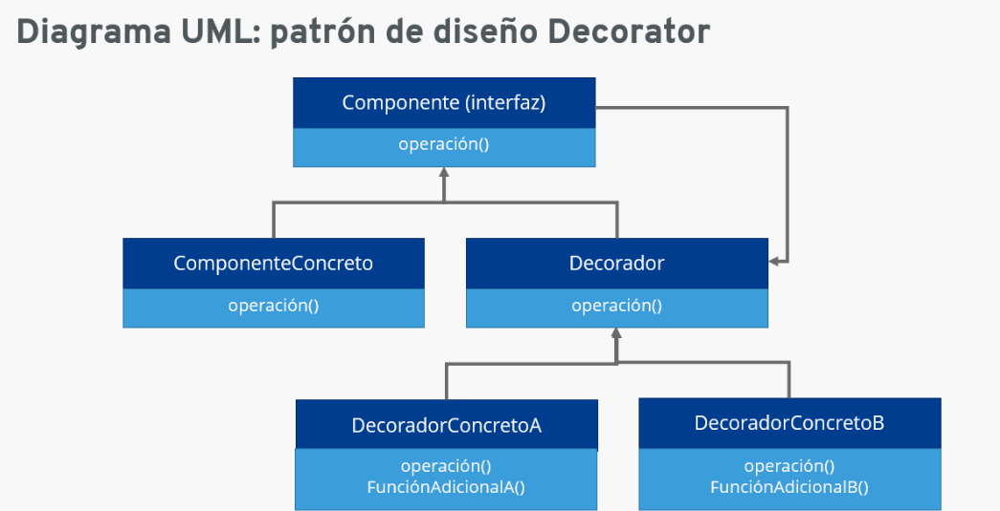
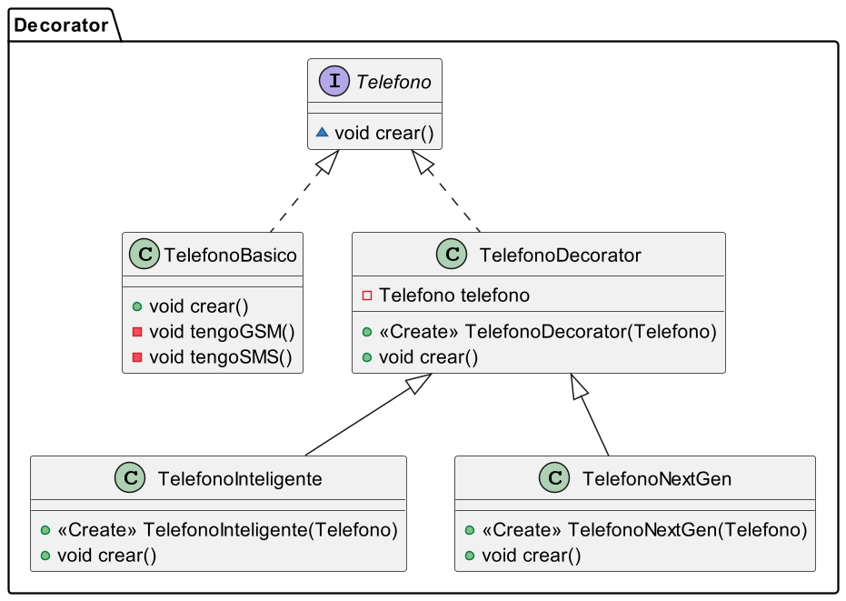
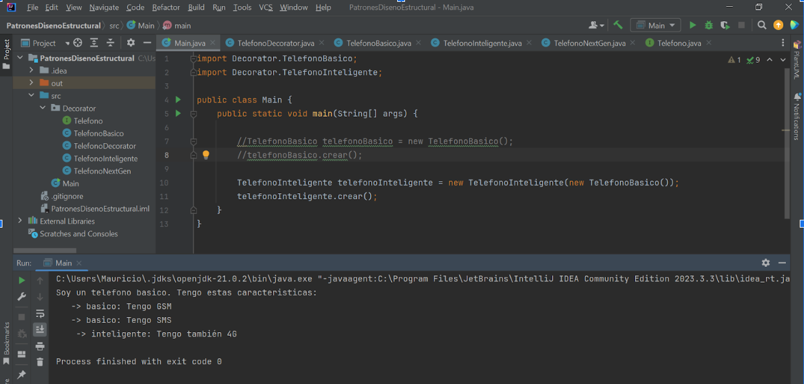
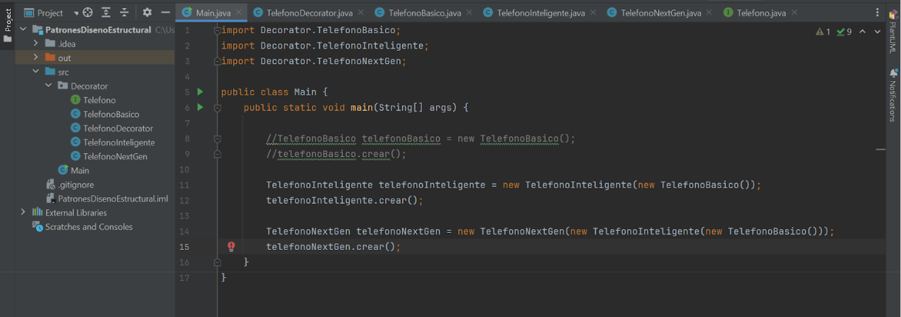
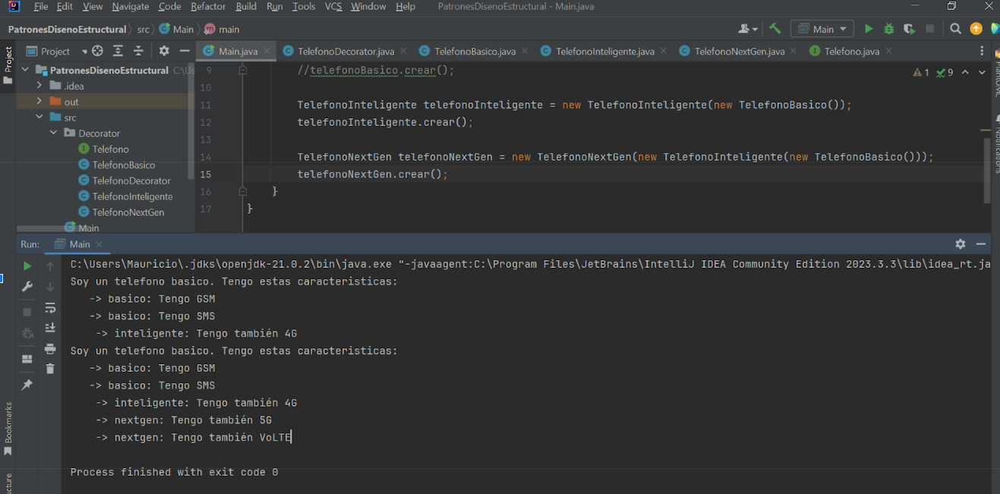

# **Patrón de Diseño Decorator**

## Descripción

El patrón de diseño Decorator es una solución estructural que permite añadir funcionalidades adicionales a objetos de manera dinámica. Este patrón se utiliza para adherir comportamientos a objetos individuales, sin afectar el comportamiento de otros objetos de la misma clase. El Decorator proporciona una alternativa flexible a la herencia para extender funcionalidades.

## Características Clave

Composición sobre Herencia: En lugar de utilizar la herencia para extender la funcionalidad, el patrón Decorator usa la composición para "envolver" objetos y añadirles nuevas responsabilidades.

Adición Dinámica de Comportamientos: Los objetos pueden ser decorados de manera dinámica en tiempo de ejecución, permitiendo una mayor flexibilidad y reutilización de código.

Independencia de Comportamientos: Cada decorador es independiente y puede combinarse de diversas maneras para crear objetos con múltiples comportamientos combinados.

Cumplimiento del Principio Abierto/Cerrado: El patrón Decorator sigue el principio de estar "abierto para extensión, pero cerrado para modificación", lo que significa que puedes añadir nuevas funcionalidades sin cambiar el código existente.
Estructura

Componente (Component): Define la interfaz para los objetos que pueden tener responsabilidades añadidas dinámicamente.
Componente Concreto (ConcreteComponent): Implementa la interfaz de Component y define un objeto básico que puede tener responsabilidades añadidas.

Decorador (Decorator): Mantiene una referencia a un objeto Component y define una interfaz que cumple con la del componente.
Decoradores Concretos (ConcreteDecorators): Extienden la clase Decorator y añaden responsabilidades adicionales al componente.

## Ventajas

Flexibilidad: Puedes combinar múltiples decoradores para añadir diferentes funcionalidades a un objeto.
Reutilización de Código: Los decoradores pueden ser reutilizados en diferentes contextos para añadir las mismas funcionalidades a diferentes objetos.

## Desventajas

Complejidad Incrementada: La estructura de clases puede ser más compleja debido a la introducción de múltiples pequeños decoradores.
Dificultad en el Depuramiento: La depuración puede ser más complicada debido a la composición de múltiples decoradores.
Esta descripción incluye una explicación detallada del patrón de diseño Decorator, sus componentes, un análisis de sus ventajas y desventajas.

En nuestro caso y para éste proyecto, tenemos un sistema que implementa el patrón de diseño Decorator y que devuelve un telefono basico, o si se quiere se le añade la funcionalidad de inteligente así como NextGen:

Como vemos tenemos en la salida por consola una respuesta de nuestra instancia telefonoInteligente, lo cual se ha creado en la Clase TelefonoInteligente cuando hemos invocado a la función o método crear();

Puesto que invocamos primero al crear() de la Clase Padre,  que es la Clase TelefonoDecorator, al cual le hemos pasado como parámetro un TelefonoBasico, el cual ha ejecutado el contenido de la Clase TelefonoBasico, así cuando haya terminado la instancia de Teléfono inteligente ejecutara su propio método crear()

Así, tenemos que: El método crear() de la Clase TelefonoNextGen invoca al método crear() de la Clase TelefonoInteligente que a su vez invoca al crear() de la Clase TelefonoBasico(); el cual finaliza, ejecuta el código pertinente volviendo al super.crear de TelefonoInteligente y posteriormente ejecuta el super.crear de la Clase TelefonoNextGen.

Si nos damos cuenta es una reacción que se dispara en cadena como bien decíamos de modo recursivo.
Y pues para esto sirve el Patrón de Diseño Estructural Decorator, es decir que a una Clase básica, la hemos envuelto en otra Clase que añadía funcionalidad y que a su vez la hemos envuelto en otra Clase que le añadía otra funcionalidad. Es como una matroska, El Patrón decorator.

